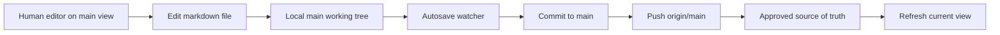
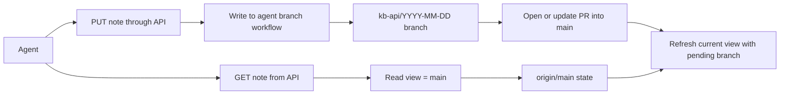
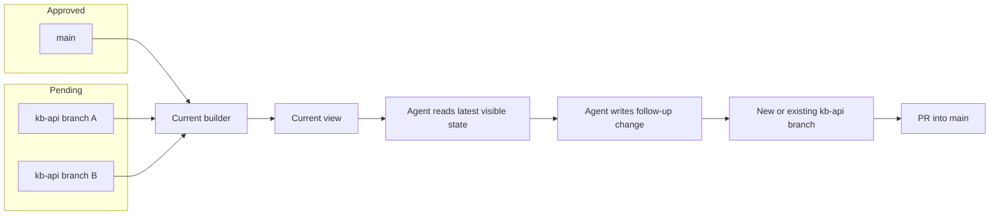
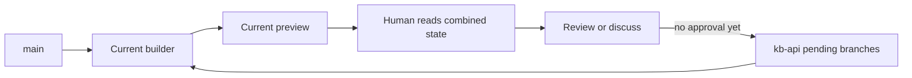
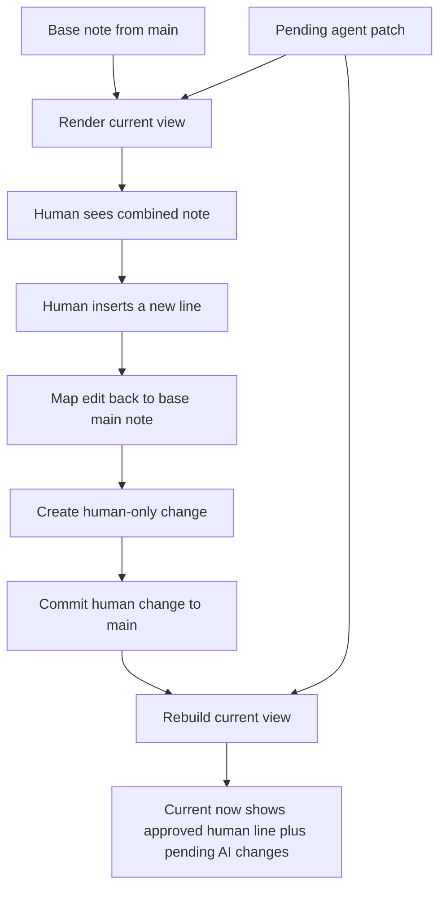
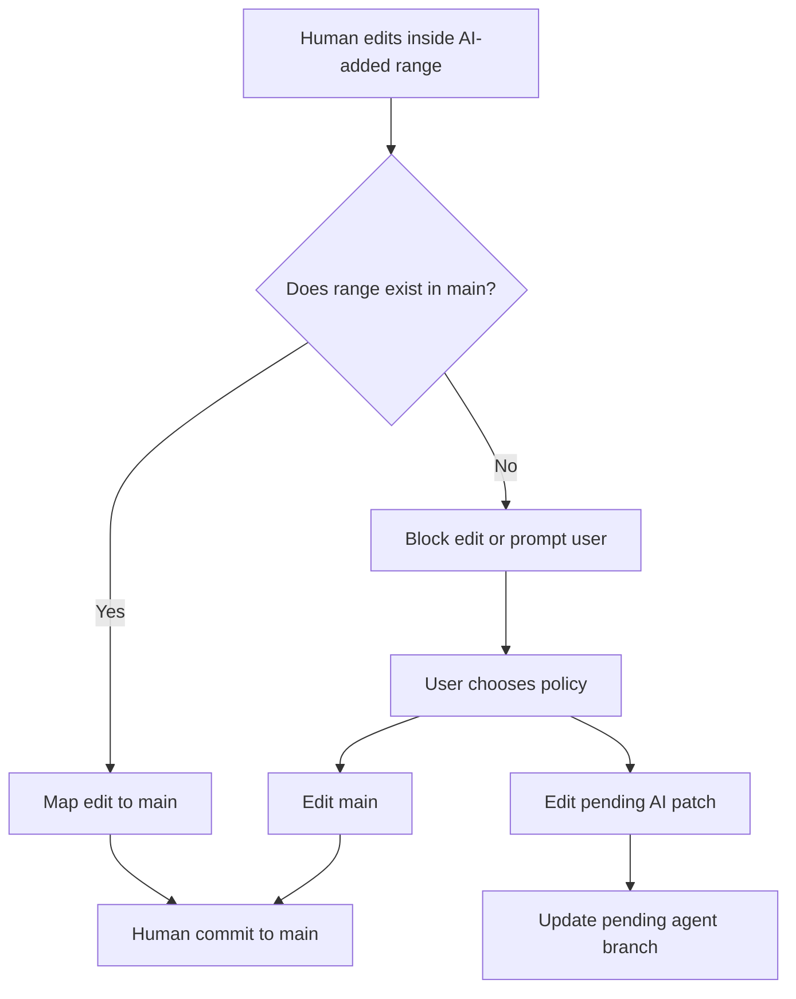
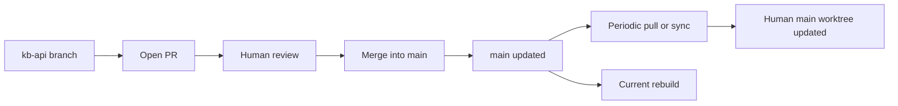
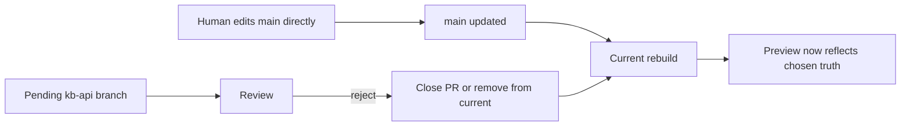

# Human vs AI Edit Separation

## Goal

Keep `main` as the approved source of truth while still allowing:

- humans to edit approved content directly
- agents to propose unapproved changes through PRs
- humans and agents to see a "latest" view that includes pending agent work
- human edits made while viewing that "latest" view to still land on `main`

## Short Answer

Use three concepts, not one:

- `main`: approved content only
- `kb-api/...`: agent-owned PR branches
- `current`: a generated preview view of `main + pending agent changes`

The key point is that `current` should be treated as a view, not a human editing branch.

If humans edit inside the combined `current` view, the system must map those edits back to `main` intentionally. Git alone cannot do that safely without extra logic.

## Current Behavior

Today the system is file-first and branch-aware, but not view-aware:

- human local edits are watched and pushed directly to `main`
- API writes are committed to a daily `kb-api/YYYY-MM-DD` branch
- a PR is opened from that API branch into `main`
- periodic pull syncs merged PRs back into the local vault

This gives a clean approval boundary, but it has two limitations:

1. A normal local checkout only shows one branch at a time.
2. The API reads from the vault working tree, which effectively means it reads approved state unless you deliberately point it at a different branch/view.

## Why A Plain `current` Branch Is Not Enough

A physical `current` branch sounds attractive:

- `main` stays approved
- `kb-api/...` stays unapproved
- `current` shows everything

But if a human opens `current` and edits there, Git only sees "the file changed on `current`". Git does not know:

- which lines came from approved `main`
- which lines came from the pending agent PR
- whether the new human line should belong to `main`, `current`, or the PR branch

So a plain `current` branch is useful for preview, but dangerous as an editing surface unless the app adds explicit routing logic for edits.

## Recommended Model

### Branch Roles

Use the following roles consistently:

| Branch or view | Purpose | Who owns it | Merge policy |
| --- | --- | --- | --- |
| `main` | Approved knowledge | Humans | Direct human autosave or approved PR merge |
| `kb-api/YYYY-MM-DD` | Pending agent changes | API/agents | Open PR into `main` |
| `current` | Preview of approved + pending | System-generated | Never edited directly by humans |

### Working Surfaces

Use separate surfaces even if they come from the same repo:

- human editing surface: checked out on `main`
- agent write surface: checked out on `kb-api/...`
- preview surface: checked out on generated `current`, or served virtually by the API

This can be implemented as:

- multiple Git worktrees
- multiple clones
- one canonical repo plus a logical API-computed `current` view

### Recommendation On Shape

Prefer this order of implementation:

1. Keep `main` for human edits.
2. Keep `kb-api/...` for agent PRs.
3. Add a logical or materialized `current` view for reads.
4. Do not allow freeform human edits on `current` unless you build explicit edit-routing logic.

## Two Implementation Styles

### Option A: Materialized `current` branch

The system periodically updates a real `current` branch so it always represents:

`current = main + all selected unapproved agent branches`

Pros:

- easy to inspect with normal Git tools
- easy for humans to browse locally
- easy for agents to read if they are pointed at `current`

Cons:

- branch maintenance logic is required
- conflict handling becomes a system responsibility
- editing on `current` is still ambiguous unless routed

### Option B: Logical `current` view

The system never creates a real `current` branch. Instead, the API serves:

- `view=main`
- `view=current`
- optionally `view=pr:<branch>`

Pros:

- cleaner mental model
- no extra branch churn
- easier to control edit rules
- better long-term fit if agent and human edits need different semantics

Cons:

- requires app-level merge/render logic
- harder to inspect with plain Git alone

## Recommendation

For this project, the strongest model is:

- keep Git PR branches for approval
- add API-level support for `current`
- treat `current` as a read view first
- only later add write support for `current` if you also add edit-routing rules

That solves the "agent only sees `main`" problem without forcing all users to live on a synthetic Git branch.

## Cases

### Case 1: Human edits approved content

Human works from the `main` editing surface.

Result:

- file changes are committed to `main`
- autosave pushes to `origin/main`
- `current` later includes those approved changes automatically

### Case 2: Agent writes a new change through the API

Agent starts from approved state unless it explicitly asks for another view.

Result:

- agent reads `main`
- agent writes content through API
- server writes to agent-owned branch
- PR remains unapproved until review
- `main` is untouched
- `current` includes the pending PR content

### Case 3: Agent needs to see unapproved PR content too

This is the missing capability in the current design.

The agent must read from a `current` concept rather than always reading `main`.

Two acceptable ways:

- API serves `GET /notes/...?...view=current`
- API reads from a materialized `current` branch or worktree

Result:

- agent can reason over pending AI work
- new AI edits are generated against the latest visible state
- approval still happens through PRs into `main`

### Case 4: Human wants to browse pending agent changes without approving them

Human opens `current` for reading only.

Result:

- they see approved plus pending content in one place
- nothing is approved merely by viewing it
- `main` remains clean

### Case 5: Human is viewing `current` and adds a new line that should go to `main`

This is the most important case.

Desired behavior:

- human sees `main + pending AI`
- human types one new line
- that new line should become approved content on `main`
- the pending AI lines should remain pending

This cannot be done safely by raw Git alone. The system must route the edit.

The correct behavior is:

1. UI shows `current`.
2. User inserts text.
3. App maps the edit back to the `main` version of the note.
4. Human patch is saved onto `main`.
5. Pending AI overlay remains separate.
6. `current` is rebuilt and now shows both.

### Case 6: Human edits inside agent-added text while viewing `current`

This is ambiguous and needs a product rule.

Possible rules:

- disallow editing agent-owned ranges
- ask whether the edit should modify `main` or the pending AI patch
- fork the pending AI patch and create a new human patch on top

Recommended first rule:

- allow human edits only in ranges that map cleanly to `main`
- show agent-added ranges as read-only or explicitly "pending AI"

### Case 7: PR is approved

Once approved, the pending branch is merged into `main`.

Result:

- `main` now contains the previously pending AI change
- periodic pull or sync updates local human surfaces
- `current` no longer needs that pending delta because it is now approved

### Case 8: PR is rejected or partially replaced by human edits

If the human adds approved changes directly to `main` and decides not to approve the AI patch:

- `main` continues with human-approved content
- pending AI branch can be closed, rebased, or regenerated
- `current` stops showing that branch once it is excluded

## Data Ownership Rules

To keep the system understandable, use simple ownership rules:

- humans own `main`
- agents own `kb-api/...`
- system owns `current`
- approval moves content from agent-owned to human-approved

This avoids the biggest failure mode: humans and agents editing the same synthetic branch with no provenance.

## API Implications

To support `current`, the API should eventually expose view selection on reads.

Suggested read semantics:

- `GET /notes/{path}` -> defaults to `view=main`
- `GET /notes/{path}?view=current` -> approved plus pending visible content
- `GET /notes/{path}?view=branch:kb-api/2026-03-06` -> read a specific pending branch

Suggested write semantics:

- human local edits continue to write to `main`
- agent writes continue through API into `kb-api/...`
- writes against `view=current` are rejected unless explicit edit-routing exists

## Branch Strategy vs API-Only Strategy

### Hybrid strategy

Humans edit files locally. Agents write through the API.

This is the recommended near-term model because it preserves the best human editing experience while keeping AI writes reviewable.

### API-only strategy

Everything goes through the API, including human edits.

This gives the strongest central control, but it makes normal local markdown editing feel unnatural unless the client experience is rebuilt around the API.

## Recommendation Summary

Use the following architecture:

- `main` stays approved-only
- agent writes continue on `kb-api/...` branches
- add a `current` concept for reads so agents can see pending work
- implement `current` as an API view first, not as a human editing branch
- treat edits made while viewing `current` as a special routed workflow, not a normal Git edit

## Practical Rollout

### Phase 1

- keep existing human `main` flow
- keep existing API PR flow
- add read support for `current`
- use `current` as read-only preview

### Phase 2

- allow agents to read from `current`
- define which pending branches are included in `current`
- add conflict policy for overlapping pending branches

### Phase 3

- add human editing while viewing `current`
- route edits back to `main`
- lock or prompt on edits inside AI-only ranges

## Final Principle

If the system needs to answer:

"I can see pending AI content, but my new human sentence should still become approved content on `main`"

then `current` must be treated as a composed view with provenance, not just as another Git branch.
